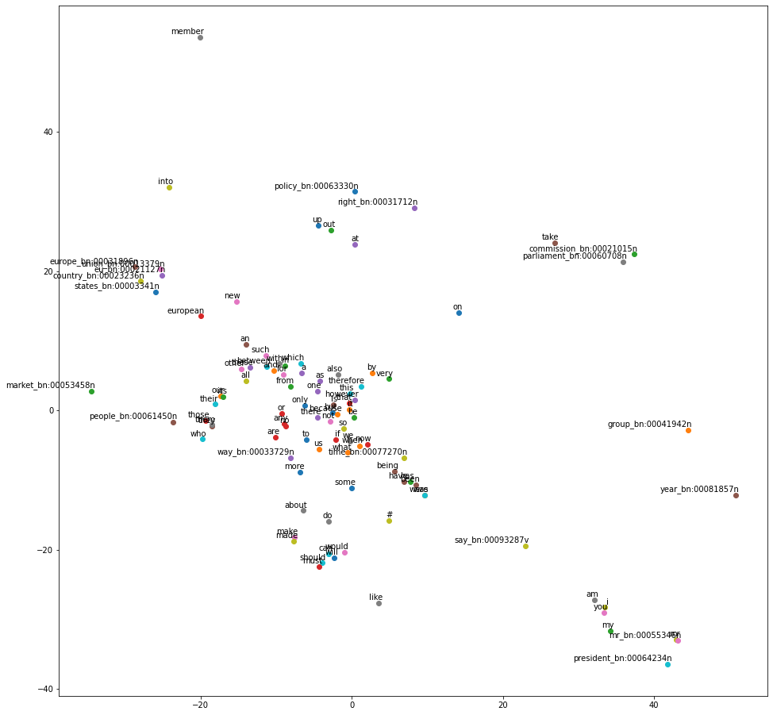
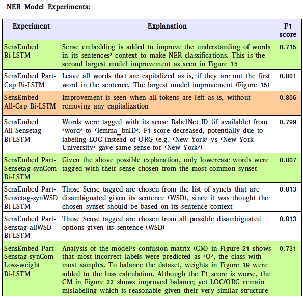
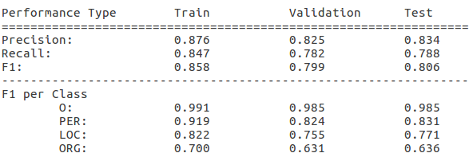

Abstract

A Named Entity Recognition (NER) task is
implemented to understand words as a loca-
tion (LOC), an organization (ORG), a person
(PER), or other (O). The neural network ar-
chitecture has a pre-trained Sense Embedding
layer, two Bi-LSTM layers with dropout, and
Adam optimizer. The model resulted in a F1
score of 0.806 for all classes.

Introduction
Language for an adult that understands the dialect
is simple and effortless. However in order for ma-
chines to understand this, Natural Language Pro-
cessing is necessary to be able to read, understand,
and derive meaning to language. One way to derive
meaning is by processing text using Named Entity
Recognition where the machine can recognize cer-
tain words as a location (LOC), an organization
(ORG), a person (PER), or other (O).
A NER neural network algorithm is used with a
Bidirectional Long short Term Memory (Bi-LSTM)
architecture and an embedding layer previously
trained using Sense Tags. The Bi-LSTM uses past
and future labels in a sequence to identify and clas-
sify named entities in text that can be later used for
tasks such as recommendation systems.

